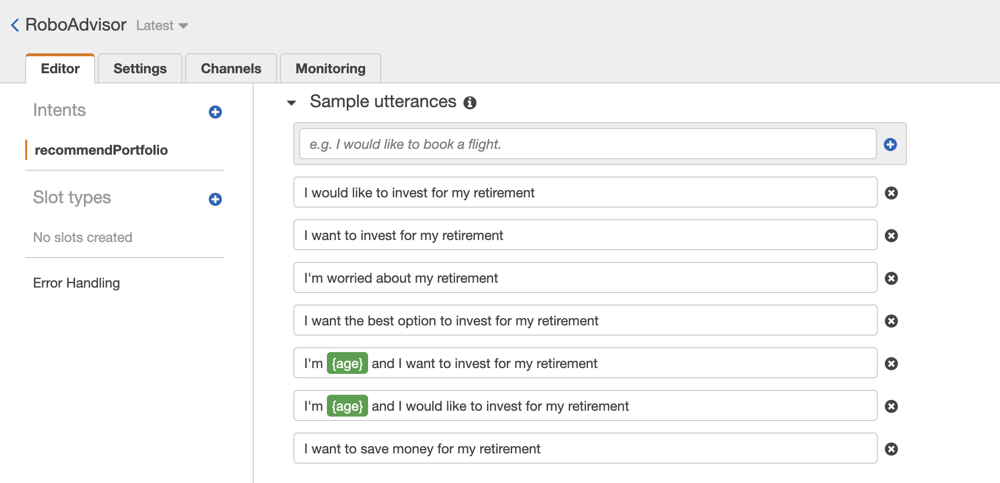
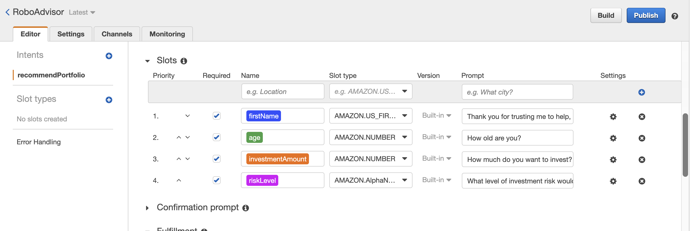
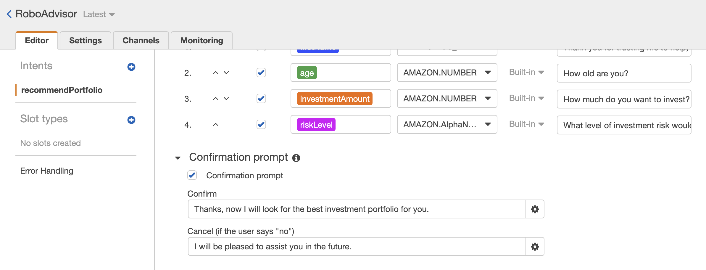
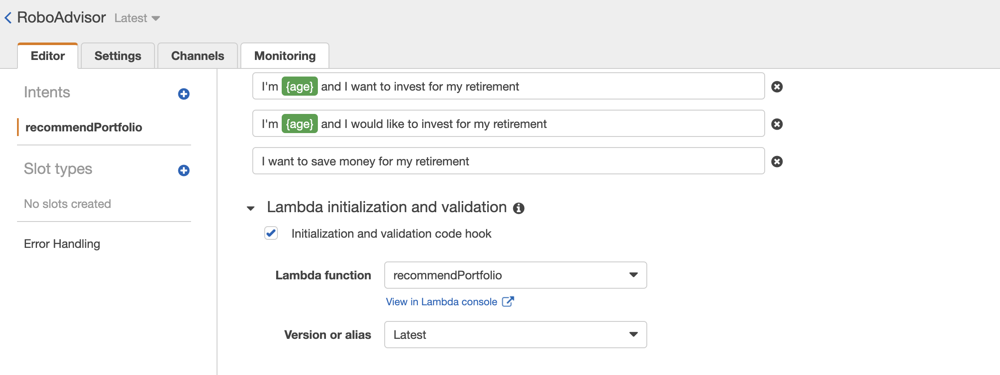
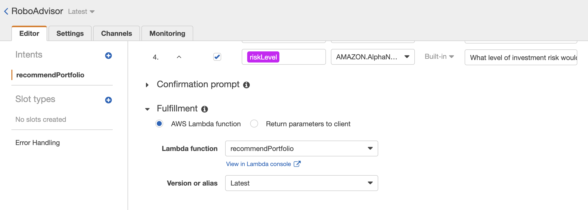

# eVisor

**eVisor** is a robo advisor that provides tailored retirement portfolio recommendations.

---

## Solution Overview

The eVisor robo advisor is a cloud native solution leveraging AWS serverless services to provide an intuitive and easy-to-use solution for providing tailored retirement portfolio recommendations.  The main components of the solution are:

* **Chatbot Conversational User Interface**: The chatbot convesational user interface (CUI) provides an intuitive expereince where users can seek retirement advice by using plain engilish.  No user training needed.  The chatbot is able to infer and collect required data elements from the user through natural language conversation with the user.  

* **Business Logic**: Once the chatbot has collected the required data elements, it submits these to a compute service that processes the input and returns a tailored recommendation based on the provided input.

---

## Solution Development Approach
The approach to develop this solution was:
1. Develop and test the chatbot CUI
1. Develop and test the business logic
1. Integrate the buisness logic into the chatbot and test the overall integrated solution

### Chatbot CUI

* **Amazon LEX** was used to develop the conversational UI. 

#### Chatbot Configuration
The chatbot was configured as shown below:

##### Utterances

##### Slots

##### Confirmation

#### Chatbot CUI Testing
Once the chatbot was configured, it was tested.  The following video shows a conversation with the configured chatbot.

https://user-images.githubusercontent.com/9788128/175858642-07879c45-118d-41d6-bd9e-f6d5446ad287.mov

### Business Logic

* **AWS Lambda** was used to implement the business logic.  **AWS Lambda** is a serverless technology that allows business logic to be implemented and deployed in the cloud without having to worry about servers and other infrastructure.  **AWS Lambda** can be integrated with other services, such as **Amazon LEX**, to quickly create custom solutions.

#### Lambda Deployment

The lambda code was written and uploaded into **AWS LAMBDA**.  see [Lambda/lambda_function.py](Lambda/lambda_function.py)

#### Lambda Testing

The lambda function was then testing using sample test events.  The following test scenarios were used to test the lambda function:

| Scenario | Objective | Test Event |
|----------|-----------|------------|
| **Invalid Age - Negative Age** | This scenario confirms that the business logic can properly validate age, ensuring that age must be > 0 | [negativeAgeError.json](Test_Events/negativeAgeError.json) |
| **Invalid Age - Excessive Age** | This scenario confirms that the business logic can properly validate age, ensuring that age must be < 65 | [negativeAgeError.json](Test_Events/negativeAgeError.json) |
| **Invalid Amount - Low Amount** | This scenario confirms that the business logic can properly validate investment amount, ensuring that investment amount > 5000 | [incorrectAmountError.json](Test_Events/incorrectAmountError.json) |
| **Correct Dialog** | This scenario confirmed that the business logic worked properly when provided valid input | [correctDialog.json](Test_Events/correctDialog.json) |

### Solution Integration

After the chatbot CUI and the business logic were confirmed to be working as expected, the solution was integrated together.

#### Chatbot Lambda initialization and validation
The chatbot was configured to use the above Lambda function the function validates user input.

#### Chatbot Fulfillment
The chatbot was configured to use the above Lambda function the function to fulfill the user request.

---

## Solution Demo
The following video shows a conversation where an end user is getting customized retirement portfolio advice from eVisor using the chatbot natural language interface.

https://user-images.githubusercontent.com/9788128/175858678-d61d54fa-c987-4891-bed1-dc9a7fb0b379.mov

---

## Contributors

*  **Martin Smith** &nbsp;&nbsp; |
&nbsp;&nbsp; *email:* msmith92663@gmail.com &nbsp;&nbsp;|
&nbsp;&nbsp; 

---

## License

